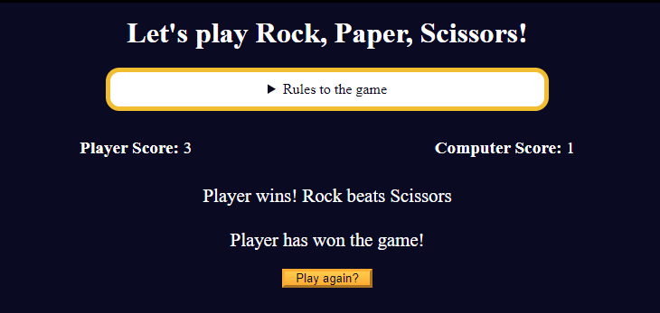

# Mini Project: Rock, Paper, Scissors Game

## Description

This **JavaScript-based project** is a classic **Rock, Paper, Scissors** game where a player competes against the computer. The first to score three points wins! The game features dynamic score updates, player interaction through buttons, and a reset functionality.

_#freeCodeCamp JavaScript Algorithms and Data Structures Projects_

## Example Gameplay

## Live Demo

[Click To Play Online](https://quintin-dev.github.io/JavaScript-Mini_Project-Rock_Paper_Scissors_Game/)

## Features

-   **Dynamic Gameplay**
    -   Players can choose between Rock, Paper, and Scissors using interactive buttons.
-   **Score Tracking**
    -   Real-time score updates for both the player and the computer.
-   **Game Rules Display**
    -   Includes a collapsible section outlining the game rules.
-   **Winner Announcement**
    -   Declares the winner once the first player scores three points.
-   **Reset Functionality**
    -   Players can reset the game and start a new session.

## Technologies Used

-   **HTML**: For structuring the game interface.
-   **CSS**: To style the game with an appealing design and responsive layout.
-   **JavaScript**: For game logic and interactivity.

## How to Play

1. Select one of the three options: Rock, Paper, or Scissors.
2. The computer makes a random choice, and the result of the round is displayed.
3. Scores are updated based on the outcome:
    - Rock beats Scissors.
    - Scissors beats Paper.
    - Paper beats Rock.
4. The first to reach three points wins the game.
5. Use the "Play again?" button to reset the game and play another session.

## Disclaimer

This project is part of the **JavaScript Algorithms and Data Structures Projects** on freeCodeCamp. The original project tutorial can be found [here](https://www.freecodecamp.org/learn/javascript-algorithms-and-data-structures-v8/).

_Don't forget to star ⭐ this repo if you liked or found it useful!_
